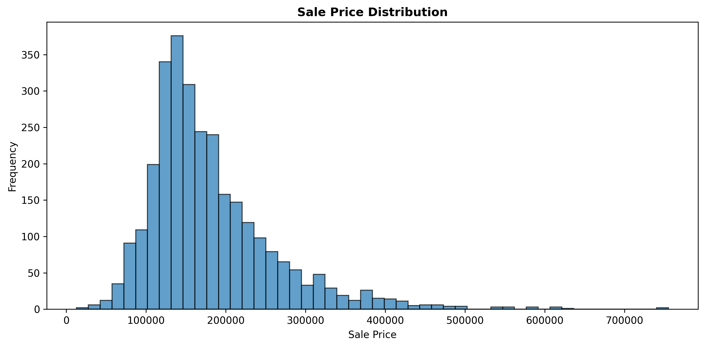
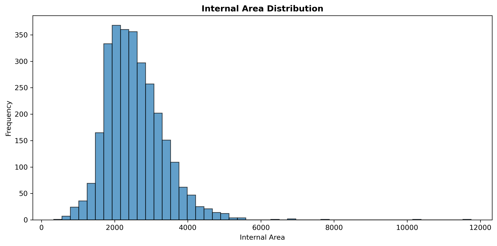
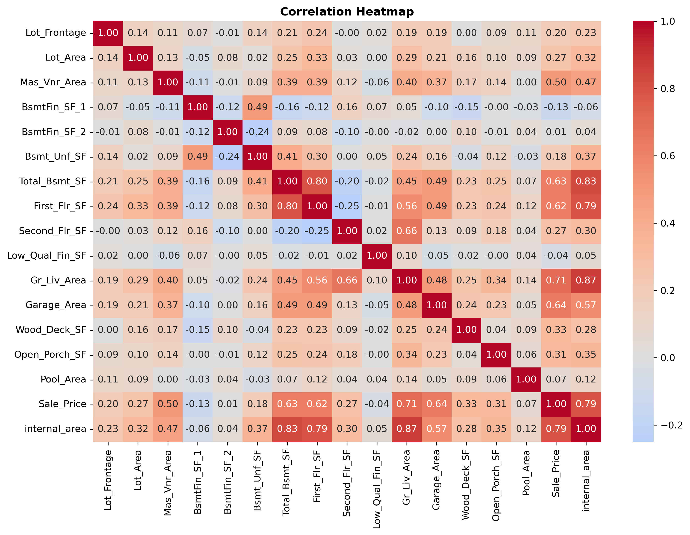
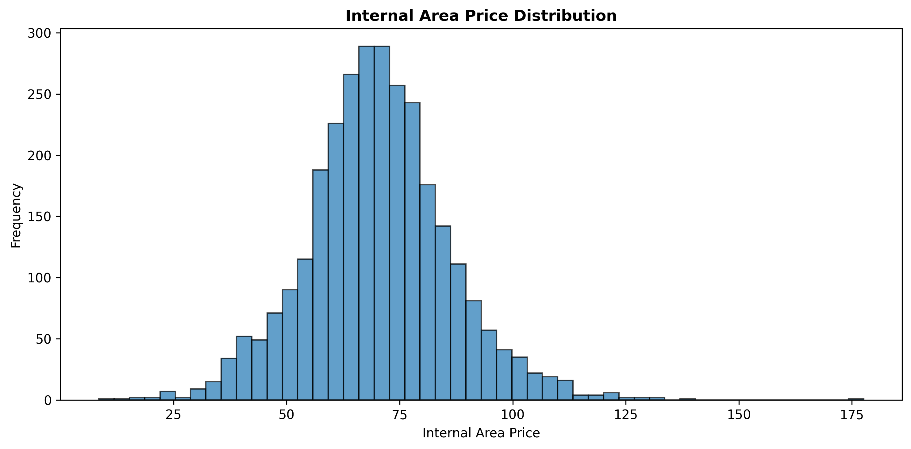
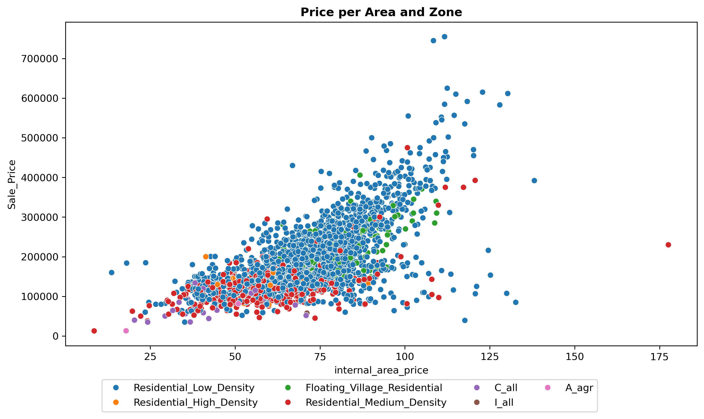
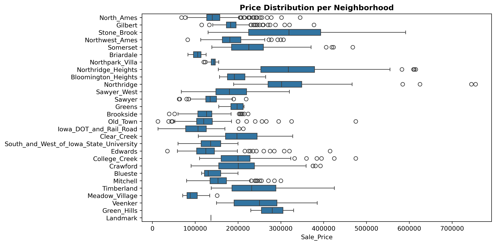

# **Exploratory Data Analysis**
---

By checking the missing values, it was found that only two of the more than 80 columns have nulls, and since they are related to house characteristics that may not be present in a property, the missing values may represent the absence of the corresponding feature rather than missing information.  
Then, a distribution of the target variable (`Sale_Price`) was plotted.

Some outliers can be seen at this right-skewed distribution, but the vast majority of the houses have their prices in a relatively tight range. Two additional distributions were then plotted in order to understand this phenomenon, one using internal area and the other using lot area. The internal area was created for this EDA and represents the sum of the above-grade living area (`Gr_Liv_Area`) and total basement area (`Total_Bsmt_SF`). It might be worth pointing out that every area in the dataset is measured in square feet. The distribution of this new variable is shown below:

Although not identical, it is very similar to the sale price distribution, also presenting some outliers at the asymmetric right tail. The lot area distribution, however, was even more right-skewed. The correlation analysis below shows a weaker relationship between lot area and sale price.  

As can be seen, there is a strong correlation between internal area and sale price, which is consistent with the similar shapes of their distributions. The newly created `internal_area` is also strongly correlated with its component variables, as expected from its construction, and there is also a moderate positive correlation between `Garage_Area` and both `Sale_Price` and `Gr_Liv_Area`.  
The internal area was used to create a second new variable called `internal_area_price`, obtained by dividing `Sale_Price` by `internal_area`. The distribution of this variable was also plotted.

The distribution remains right-skewed, but is considerably more concentrated than the sale price and internal area distributions, with most properties falling within a relatively narrow range of price per square foot. In the end, sale price, internal area, and especially lot area exhibit right-skewed distributions with a small number of extreme observations.  
A scatterplot was created to visualize the relationship between sale price and `internal_area_price`, with points colored according to zoning category.

It shows that the zoning categories are highly unbalanced, with Residential Low Density accounting for most observations. The price-area relationship also shows substantial overlap between zoning categories.  
When it comes to neighborhoods, the number of observations is unevenly distributed across them, with some neighborhoods containing substantially more properties than others.  
Finally, the sale price distribution was represented using boxplots for each of the 28 neighborhoods on the dataset, resulting in the following chart:

Several neighborhoods contain numerous observations beyond the upper whisker, indicating substantial within-neighborhood variation in sale prices and the presence of high-priced properties.

The images included here, along with the other EDA charts, can be found in `images/eda`.